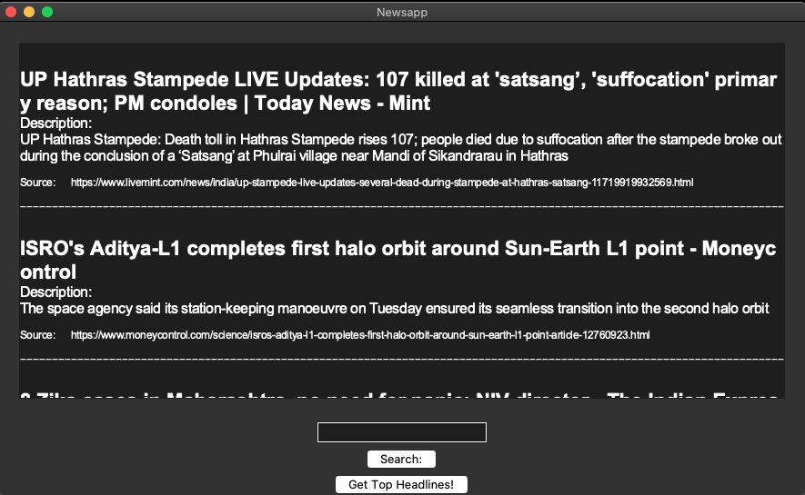

# News-Application
A basic news application coded in Python

## To make it work:
Get your Api Key from https://newsapi.org and enter the value in the API_KEY attribute in functions.py
## About
-Uses python tkinter module for the GUI
-Uses open newsapi for the news
## Features:
-Allows users to get current top headlines on the click of button 
-Allows users to search through the headlines
-Provides title, description and source of each news item
